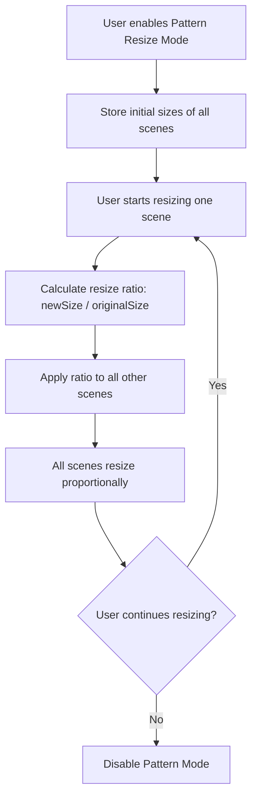

# MockupStudio Bug Fix Plan

## Issues to Fix

### Issue #1: Image Upload Problem on Custom Screens
**Problem**: When custom scenes are added, images don't show on all screens properly. Need to ensure image upload works for custom screens.

**Root Cause Analysis**:
- The `_injectDynamicUploadZone` function exists in `js/dynamic-screens.js` but may have issues with image display
- Need to verify the image is being properly associated with the correct frame element

**Solution**:
1. Check the `_remapDynamicIds` function to ensure image elements are properly mapped
2. Verify the upload zone is correctly targeting the dynamic frame's image element
3. Ensure image display logic works for all custom screen types (desktop, mobile, tablet)

---

### Issue #2: Proportional Resize for Scenes in Free Mode
**Problem**: When resizing scenes in free mode, the scene dimensions in the layout change. User wants to keep the original added size and resize all scenes together proportionally (pattern/parallel mode).

**Current Behavior**:
- Each scene resizes independently in free mode
- Scene dimensions in layout change when resized

**Desired Behavior**:
- Implement a "pattern resize" mode where all scenes resize together proportionally
- When one scene is resized, all other scenes should resize by the same proportion
- This maintains the relative sizes between scenes

**Solution**:
1. Add a new toggle button for "Pattern/Parallel Resize" mode
2. When enabled, store initial sizes of all scenes
3. On resize, calculate the ratio and apply to all scenes proportionally
4. Modify the resize handlers in both `js/drag-resize.js` and `js/dynamic-screens.js`

---

### Issue #3: Add Wrong/AK Icon to Left Sidebar
**Problem**: Need to add a delete/remove icon to the left sidebar for managing dynamic screens, similar to right sidebar functionality.

**Solution**:
1. Add a new rail-icon to the left sidebar icon-rail in `index.html`
2. This icon should allow users to access dynamic screen management (remove/customize screens)
3. Add corresponding panel or functionality in `js/ui-builder.js`

---

## Implementation Steps

### Step 1: Fix Image Upload for Custom Screens
- [ ] Review `_remapDynamicIds` in `js/dynamic-screens.js` for proper ID mapping
- [ ] Verify `_injectDynamicUploadZone` correctly targets dynamic frame images
- [ ] Test image upload and display on all custom screen types

### Step 2: Implement Proportional/Pattern Resize
- [ ] Add pattern resize toggle button to UI
- [ ] Create pattern resize state in `js/state.js`
- [ ] Modify resize handlers to support proportional resize
- [ ] Implement logic to resize all scenes together when pattern mode is enabled

### Step 3: Add Left Sidebar Icon
- [ ] Add new rail-icon to left sidebar in `index.html`
- [ ] Implement panel/functionality for dynamic screen management
- [ ] Add appropriate icon (delete/remove/wrong icon)

---

## Files to Modify

1. `index.html` - Add left sidebar icon
2. `js/dynamic-screens.js` - Fix image upload, add proportional resize logic
3. `js/drag-resize.js` - Add proportional resize logic for main frames
4. `js/state.js` - Add pattern resize state
5. `js/ui-builder.js` - Add panel functionality for dynamic screens

---

## Mermaid Diagram: Proportional Resize Flow

---

## Notes

- The proportional resize should work for both the main frames (desktop, mobile, tablet) and dynamic/custom frames
- Need to handle edge cases like minimum frame sizes
- The left sidebar icon should be intuitive - likely a delete/remove icon for managing custom screens
